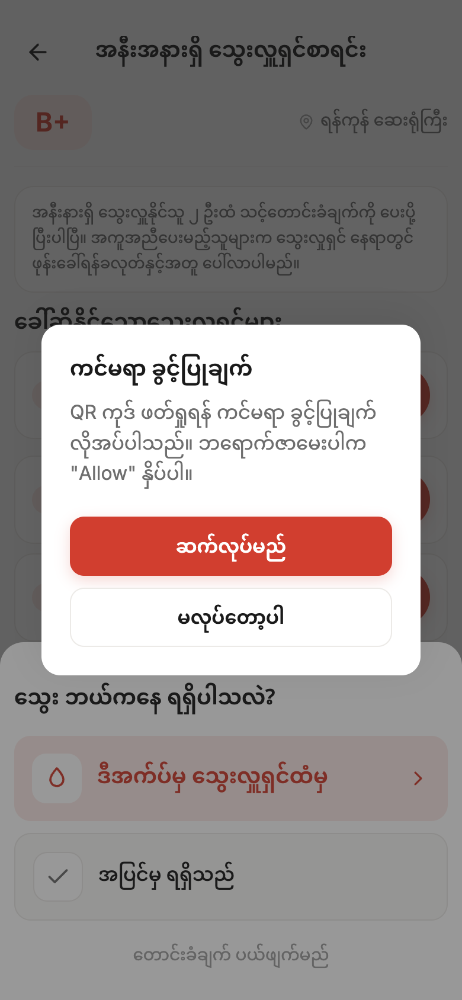

<div align="center">

# 🩸 Blood Help

### Turning an hours-long search for blood into help within minutes.

A free, non-profit, **Burmese-first** Progressive Web App that connects people who
urgently need blood with nearby, blood-compatible donors — so a donor can be
alerted and call back in minutes, not hours.

<br />

[](https://react.dev)
[](https://www.typescriptlang.org)
[](https://vite.dev)
[](https://tailwindcss.com)
[](https://supabase.com)
[](https://firebase.google.com/products/cloud-messaging)
[](https://web.dev/progressive-web-apps/)
[](LICENSE)

<br />

<table>
  <tr>
    <td align="center"></td>
    <td align="center"></td>
    <td align="center"></td>
  </tr>
  <tr>
    <td align="center"><sub>One profile — request <i>or</i> donate</sub></td>
    <td align="center"><sub>Nearby compatible donors, alerted live</sub></td>
    <td align="center"><sub>Recognising the donors who show up</sub></td>
  </tr>
</table>

</div>

---

## Table of Contents

- [Overview](#overview)
- [Why Blood Help](#why-blood-help)
- [How It Works](#how-it-works)
  - [Shared start: sign in](#shared-start-sign-in)
  - [🩹 Donor flow](#-donor-flow)
  - [🚑 Requester flow](#-requester-flow)
- [Tech Stack and Features](#tech-stack-and-features)
- [Getting Started](#getting-started)
- [Project Structure](#project-structure)
- [Roadmap](#roadmap)
- [Contributing](#contributing)
- [License](#license)

---

## Overview

In Myanmar and across much of Southeast Asia, finding blood in an emergency often
means a family member calling everyone they know, posting in Facebook groups, and
waiting — for hours — while a patient needs blood *now*.

**Blood Help** replaces that frantic search with a single tap. A person posts a
blood request; the app instantly finds nearby donors whose blood type is
compatible, sends them a push alert, and lets them call back. What used to take
hours can happen in minutes.

It is built to be:

- **Burmese-first** — every screen ships in Burmese (Noto Sans Myanmar) and English, including Burmese numerals.
- **Privacy-conscious** — locations are coarsened before they leave the device; phone numbers are revealed only when a donor opts in to help.
- **Free and non-profit** — no fees, no ads, no data resale. The only goal is reaching a donor faster.
- **One unified profile** — "requesting blood" and "being available to donate" are two *actions* a single user can take, not two account types.
- **Mobile-first and installable** — a Progressive Web App that runs in the browser or installs to the home screen, designed for small screens and patchy connections.

> **Core value:** A person can post a blood request and have nearby, blood-compatible
> donors actually receive an alert and call them back — turning an hours-long search
> into help within minutes.

---

## Why Blood Help

### The problem

| Today's reality | The cost |
|---|---|
| Searching means phone calls, group chats, and word of mouth | Hours lost while a patient waits |
| No way to know *who nearby* is even compatible | Effort wasted contacting the wrong blood types |
| Donors who *would* help never hear about the need in time | Willing donors sit idle a few kilometres away |
| Contact details get copy-pasted across public groups | Real privacy and safety risks |

### The Blood Help advantage

- ⚡ **Minutes, not hours** — a request fans out to compatible donors the moment it's posted.
- 📍 **Local by design** — geo-matching surfaces only donors within range, ranked by distance.
- 🩸 **Compatibility-aware** — a directional ABO/Rh map means donors only ever see requests they can actually give to (O− sees everyone; AB+ only AB+).
- 🔔 **Reaches donors where they are** — push notifications (FCM) plus an in-app incoming-request alert.
- 🔐 **Privacy by default** — coarsened GPS, and phone numbers gated behind an explicit "I'll help".
- 🌐 **Bilingual and inclusive** — full Burmese + English, built for the people who actually use it.
- 📲 **Installable PWA** — no app store, works offline-first for the shell, updates instantly.
- ❤️ **Recognition that motivates** — a live leaderboard celebrates the donors who keep showing up.

---

## How It Works

The whole product is one end-to-end loop:

> **Request → nearby compatible donors alerted → donor responds → requester confirms → lives helped.**

Both a donor and a requester start the same way, then the app branches based on
what the user came to do.

### Shared start: sign in

<table>
  <tr>
    <td align="center"></td>
    <td align="center"></td>
    <td align="center"></td>
  </tr>
  <tr>
    <td align="center"><b>1. Enter phone</b><br/><sub>Country-coded phone capture</sub></td>
    <td align="center"><b>2. Verify code</b><br/><sub>6-digit OTP on an anonymous session</sub></td>
    <td align="center"><b>3. Choose intent</b><br/><sub>"I need blood" or "I want to donate"</sub></td>
  </tr>
</table>

---

### 🩹 Donor flow

A donor sets up a profile once, opts in to alerts, and then waits to be called on
when someone compatible nearby needs blood.

<table>
  <tr>
    <td align="center"></td>
    <td align="center"></td>
    <td align="center"></td>
  </tr>
  <tr>
    <td align="center"><b>4. Set up profile</b><br/><sub>Name, blood type, availability toggle</sub></td>
    <td align="center"><b>5. Enable alerts</b><br/><sub>Opt in to push notifications</sub></td>
    <td align="center"><b>6. Stay ready</b><br/><sub>Toggle availability any time</sub></td>
  </tr>
  <tr>
    <td align="center"></td>
    <td align="center"></td>
    <td align="center"></td>
  </tr>
  <tr>
    <td align="center"><b>7. You helped 🎉</b><br/><sub>Confirmed donation, credited</sub></td>
    <td align="center"><b>8. Climb the board</b><br/><sub>Recognised among top donors</sub></td>
    <td></td>
  </tr>
</table>

> When a compatible request lands nearby, the donor receives a push alert **and** an
> in-app incoming-request modal. Tapping **"I'll help"** reveals the requester's
> number so the donor can call back immediately.

---

### 🚑 Requester flow

Someone who needs blood posts a request, watches compatible donors get alerted in
real time, and confirms the donation in person with a QR scan.

<table>
  <tr>
    <td align="center"></td>
    <td align="center"></td>
    <td align="center"></td>
  </tr>
  <tr>
    <td align="center"><b>1. Post a request</b><br/><sub>Blood type, units, urgency</sub></td>
    <td align="center"><b>2. Share location</b><br/><sub>Coarsened GPS for matching</sub></td>
    <td align="center"><b>3. Watch it go live</b><br/><sub>Nearby compatible donors alerted</sub></td>
  </tr>
  <tr>
    <td align="center"></td>
    <td align="center"></td>
    <td align="center"></td>
  </tr>
  <tr>
    <td align="center"><b>4. Mark fulfilled</b><br/><sub>A donor showed up to help</sub></td>
    <td align="center"><b>5. Allow camera</b><br/><sub>To confirm in person</sub></td>
    <td align="center"><b>6. Scan donor QR</b><br/><sub>Confirms the donation, credits the donor</sub></td>
  </tr>
</table>

> The live screen subscribes to realtime updates, so the responder list fills in as
> donors tap "I'll help" — no refresh needed. QR confirmation closes the loop and
> awards leaderboard credit to the donor who actually gave.

---

## Tech Stack and Features

### Stack

| Layer | Technology |
|---|---|
| **UI** | React 19 + TypeScript 6 |
| **Build** | Vite 8 (`@vitejs/plugin-react`, HTTPS dev via `@vitejs/plugin-basic-ssl`) |
| **Styling** | Tailwind CSS v4 — CSS-only config via `@theme` tokens in `src/index.css` (no `tailwind.config.js`) |
| **Backend** | Supabase — Postgres, anonymous auth, Row Level Security, realtime subscriptions |
| **Geo-matching** | PostGIS distance queries via SECURITY DEFINER RPCs (`donors_within_radius`, `callable_donors_for_request`, `leaderboard_top_donors`) |
| **Push** | Firebase Cloud Messaging (FCM) + a custom service worker (`src/firebase-messaging-sw.js`) |
| **QR** | `react-qr-code` (generate) + `react-zxing` (scan) for in-person fulfillment confirmation |
| **PWA** | `vite-plugin-pwa` (injectManifest strategy), installable manifest + offline shell |
| **i18n** | Hand-rolled EN/Burmese string tables, Noto Sans Myanmar, Burmese numeral formatting |
| **Hosting** | Static SPA on Vercel (`vercel.json`: SPA fallback, service-worker no-cache, security headers) |

### Key features

- 📱 **Phone + OTP sign-in** on an anonymous Supabase session — one identity for both roles.
- 🩸 **Directional blood-type compatibility** (`src/blood.ts`) — donors only ever see requests they can give to.
- 📍 **Distance-ranked geo-matching** with privacy-coarsened coordinates.
- 🔔 **Real-time donor alerts** — FCM push + in-app incoming-request modal with gated phone reveal.
- 📡 **Live request screen** — Supabase realtime fills the responder list as donors say "I'll help".
- ✅ **QR-confirmed fulfillment** — the requester scans the donor's QR to close the loop and credit the donor.
- 🏆 **Leaderboard** of top donors, backed by real aggregated data.
- 🔕 **Notifications centre** with a shared header bell across Home, Leaderboard, and Profile.
- 🌐 **Full bilingual UI** — every screen in Burmese and English, switchable on the fly.
- 🧩 **Design system** — shared `Button`, `Card`, `Input`, `Switch`, `Badge`, `BottomNav`, `ScreenHeader` primitives keyed to CSS design tokens.

### Architecture at a glance

```text
React SPA (src/App.tsx — screen state machine, no router)
│
├── screens/         Full-screen views (PhoneEntry, CreateRequest, RequestLive, …)
├── components/      Reusable design-system primitives (Button, Card, BottomNav, …)
├── blood.ts         Blood-type compatibility map + helpers
├── geolocation.ts   navigator.geolocation wrapped in a typed GeoResult
├── i18n.ts          Lang type + Burmese/English helpers
└── lib/
    ├── supabase.ts  Supabase client (auth, data, realtime)
    ├── firebase.ts  FCM app init
    └── push.ts      Push subscription + permission flow
            │
            ▼
   Supabase (Postgres + PostGIS + RLS + Realtime)  ·  Firebase Cloud Messaging
```

---

## Getting Started

### Prerequisites

- **Node.js 24.x** and **npm 11.x**
- A **Supabase** project (URL + anon key)
- A **Firebase** project with Cloud Messaging enabled (for push)

### Installation

```bash
# 1. Clone
git clone https://github.com/heinthaw-dev/blood-help.git
cd blood-help

# 2. Install dependencies
npm install

# 3. Configure environment (see below)
cp .env.example .env   # then fill in your keys

# 4. Run the dev server (HTTPS — required for geolocation, camera, and push)
npm run dev
```

### Environment variables

Create a `.env` file in the project root with the following keys:

```bash
# Supabase
VITE_SUPABASE_URL=
VITE_SUPABASE_ANON_KEY=

# Firebase Cloud Messaging
VITE_FIREBASE_API_KEY=
VITE_FIREBASE_AUTH_DOMAIN=
VITE_FIREBASE_PROJECT_ID=
VITE_FIREBASE_STORAGE_BUCKET=
VITE_FIREBASE_MESSAGING_SENDER_ID=
VITE_FIREBASE_APP_ID=
VITE_FIREBASE_VAPID_KEY=
```

> 💡 The dev server runs over **HTTPS** (`@vitejs/plugin-basic-ssl`) because
> geolocation, camera (QR scanning), and push notifications all require a secure
> context. Accept the local certificate warning the first time.

### Scripts

| Command | What it does |
|---|---|
| `npm run dev` | Start the Vite dev server with HMR (HTTPS) |
| `npm run build` | Type-check (`tsc -b`) then build the production bundle |
| `npm run preview` | Preview the production build locally |
| `npm run lint` | Run ESLint over `**/*.{ts,tsx}` |

---

## Project Structure

```text
blood-help/
├── public/                 # PWA icons, favicon
├── screenshots/            # User-flow screenshots (used in this README)
├── src/
│   ├── App.tsx             # Screen router + global state (lang, screen, user)
│   ├── main.tsx            # React DOM entry point
│   ├── index.css           # Tailwind v4 @theme design tokens
│   ├── screens/            # PhoneEntry, OtpVerification, IntentChoice,
│   │                       #   CreateRequest, RequestLive, DonorProfileSetup,
│   │                       #   DonorThankYou, DonorCongrats, Home, Profile,
│   │                       #   Leaderboard, Notifications
│   ├── components/         # Button, Card, Input, Switch, Badge, BottomNav,
│   │                       #   ScreenHeader, IncomingRequestAlert, CallButton, …
│   ├── lib/                # supabase.ts, firebase.ts, push.ts
│   ├── types/              # database.ts (generated Supabase types)
│   ├── blood.ts            # Blood-type compatibility + constants
│   ├── geolocation.ts      # Typed geolocation wrapper
│   ├── auth.ts             # localStorage-backed auth helpers
│   ├── i18n.ts             # Language type + helpers
│   ├── format.ts           # Number / phone / distance formatting
│   └── firebase-messaging-sw.js  # FCM + precache service worker
├── vite.config.ts          # React + Tailwind + PWA plugins
├── vercel.json             # SPA rewrites, SW no-cache, security headers
└── CLAUDE.md               # Project conventions for AI-assisted development
```

---

## Roadmap

Blood Help is built in milestones. The end-to-end emergency loop is **live today**.

**✅ Shipped — v2.0 "Backend Core"**
- Phone + OTP auth on anonymous Supabase sessions
- Postgres data model with Row Level Security
- PostGIS geo-matching of nearby compatible donors
- Realtime live-request screen (responders appear as they accept)
- FCM push alerts + in-app incoming-request modal
- QR-confirmed fulfillment and donor leaderboard
- Installable PWA deployed on Vercel

**🔜 Planned**
- 🔐 Personal-data purge on request close, and gated, rate-limited phone reveal *(v3)*
- 📲 Real SMS OTP via Twilio, replacing the dummy code *(v4)*
- 🌍 `react-i18next` migration for scalable translation management
- 📊 Richer donor history and impact stats

---

## Contributing

Blood Help is a non-profit project — contributions that help donors reach patients
faster are very welcome.

1. Fork the repo and create a feature branch.
2. Follow the conventions in [`CLAUDE.md`](CLAUDE.md) (Burmese-first copy, design
   tokens over hardcoded values, bilingual strings for all user-facing text).
3. Run `npm run lint` and `npm run build` before opening a PR.
4. Keep screens mobile-first and accessible on small viewports.

---

## License

Released under the [MIT License](LICENSE). © 2026 heinthaw-dev.

---

<div align="center">

**Built with ❤️ for Myanmar — so no one waits hours for blood that's minutes away.**

</div>
