

<!--
  Export to per-slide PNGs (local screenshots need the file-access flag):
    marp slides/intro.md --images png --allow-local-files
  Paths are ../screenshots/* because this deck lives in slides/.
-->

<!-- _class: cover -->
<!-- _paginate: false -->

# Blood Help

## Connect with nearby blood donors, support patients in need, and appreciate our community heroes.

Hein Thaw · @heinthaw-dev · vibecode.tours

---

# When blood is needed _now_, the search takes hours

- Families cold-call hospitals and post to Facebook groups
- No fast way to reach a **compatible** donor who's actually nearby
- Every minute of delay raises the risk
- Encourage and appreciate to donors in community.

---

# One request → nearby donors alerted → a callback

- **Post a request** — blood type, units, location
- **Compatible donors nearby get a push** — within minutes
- **They call you back or you can start the call** — help arrives, not paperwork

This end-to-end loop is the whole product. Everything else serves it.

---

<!-- _class: flow -->

# Sign in within seconds

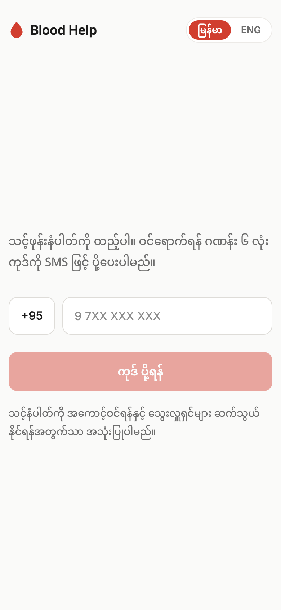
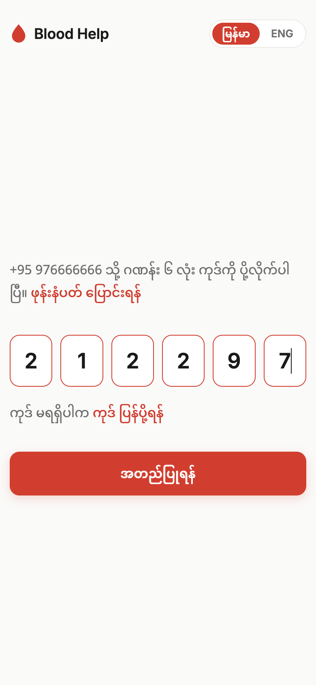

Phone number → one-time code. No passwords, no email.

---

<!-- _class: split -->

## One account

# Need blood — or give blood

- A single profile; **requesting** and **donating** are just actions you take
- You choose your path the first time you open the app
- Switch sides anytime — the same you, either way

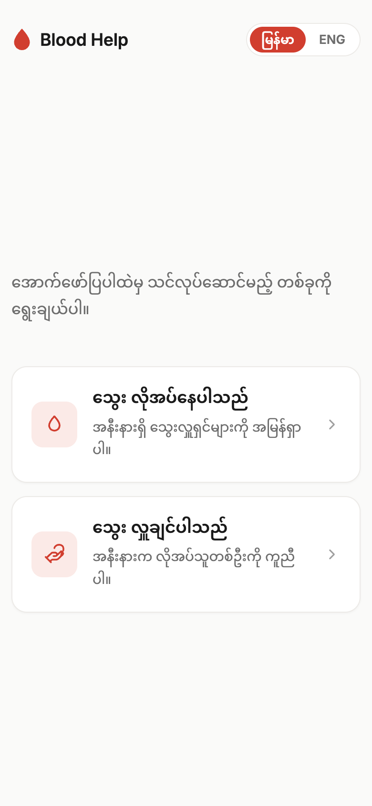

---

<!-- _class: flow -->

# Become a donor in under a minute

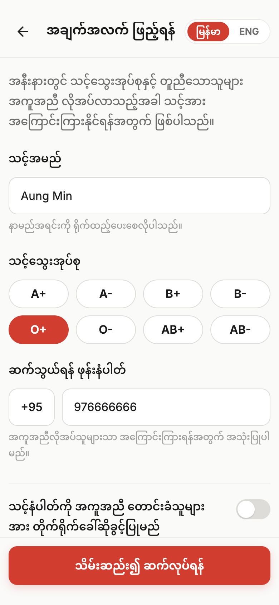
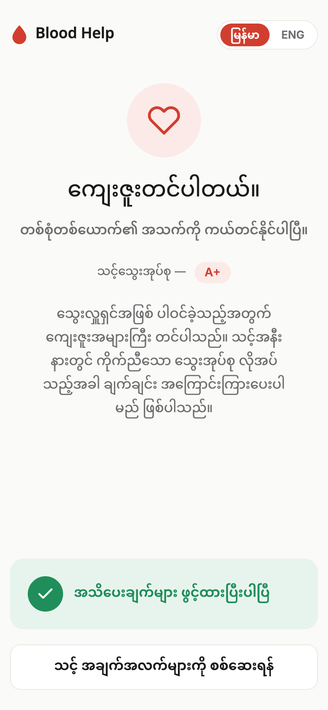

Blood type, township & contact → opt in to emergency push alerts.

---

<!-- _class: flow -->

# Post a blood request

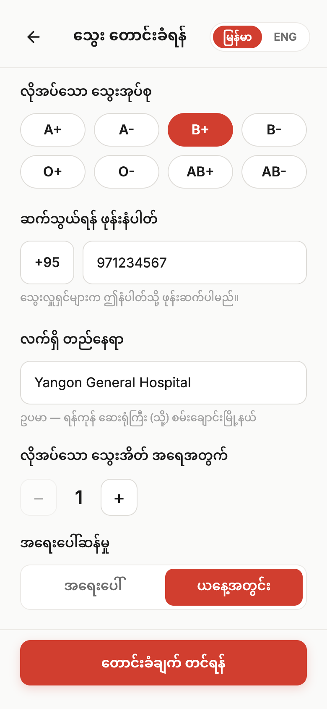
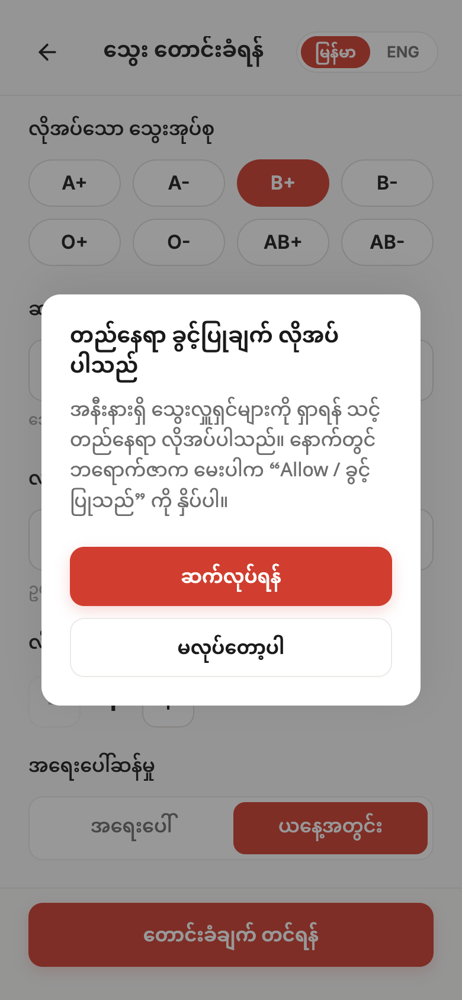

Type, units & urgency → share location so we can match donors nearby.

---

<!-- _class: split hero -->

## The core loop, live

# Nearby compatible donors, alerted in real time

- Matches light up as donors respond — no refreshing, no waiting
- The moment someone taps **"I'll help"**, you can call them back
- Hours of phone calls collapse into minutes

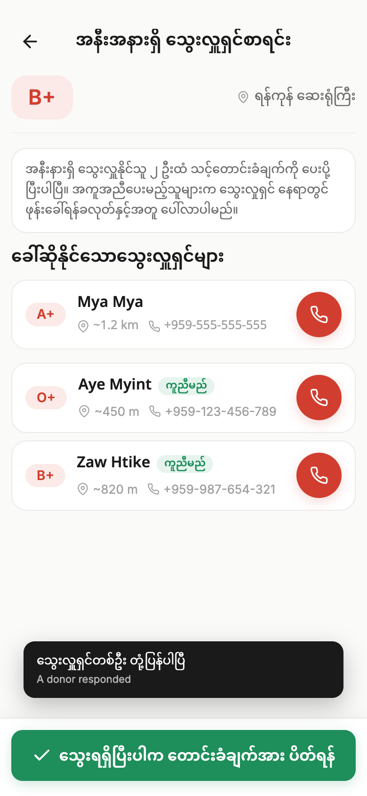

---

<!-- _class: flow -->

# Confirm the donation with a QR code

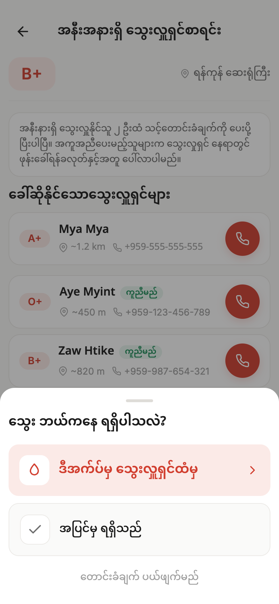
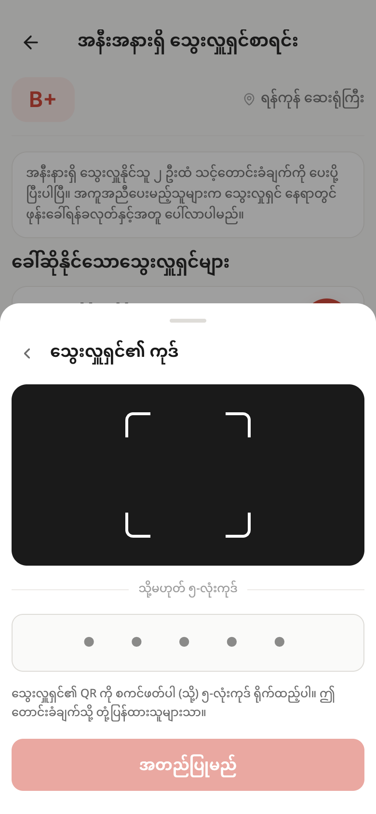
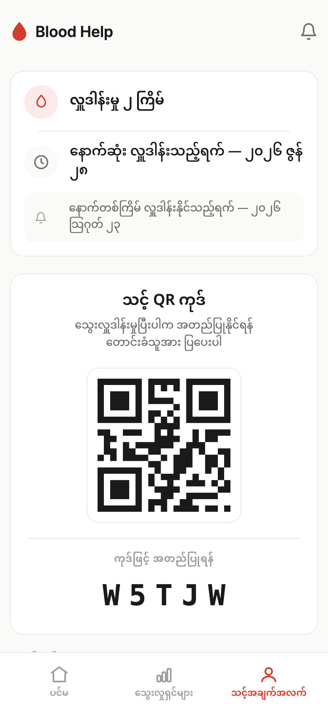

Mark fulfilled → scan the donor's code → the donor shows their QR. Verified, both sides.

---

<!-- _class: flow -->

# Recognition that builds trust

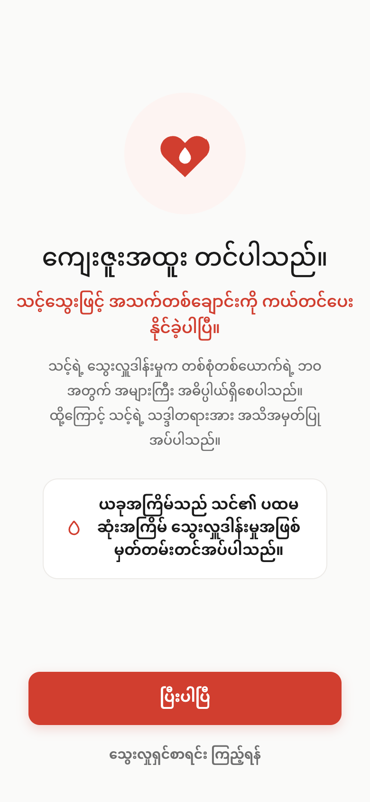
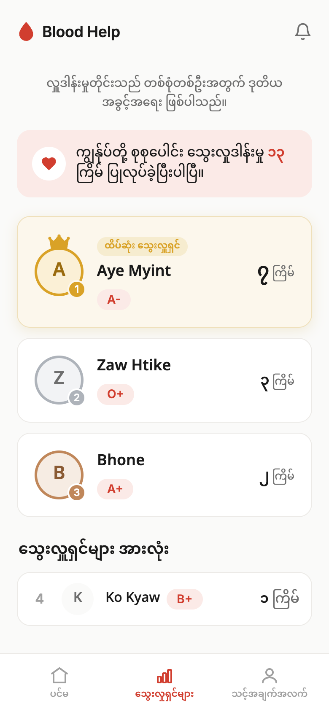

A genuine thank-you and donation milestones → a community leaderboard.

---

# How it's built

**React 19 · Vite 8 · Tailwind v4 · TypeScript** — an installable **PWA** with one merged service worker

- **Supabase (Postgres)** — auth, row-level security, Edge Functions, `pg_cron` expiry jobs
- **Supabase Realtime** — the live donor list & donor congrats-on-scan, over websockets
- **Firebase Cloud Messaging** — donor alerts, "I'll help" responses & resolution pushes
- **Phone + OTP · browser geolocation** — coarse, foreground-only for privacy

Built with **Claude Code**

---

# Try it

- **Live:** https://blood-help-ten.vercel.app/
- **Repo:** https://github.com/heinthaw-dev/blood-help
- **License:** MIT
